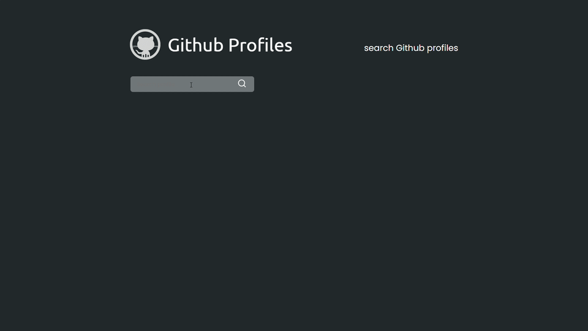
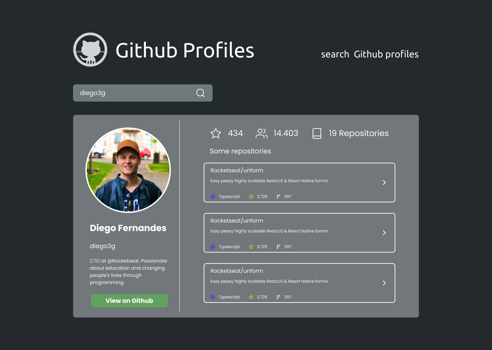
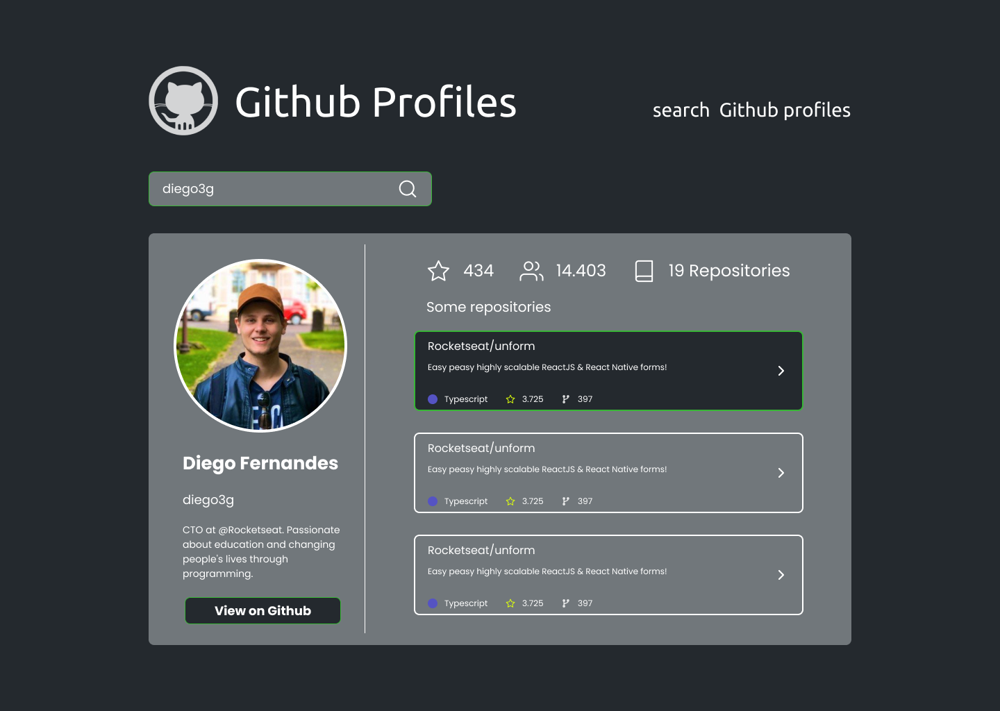

<div align="center">
  
</div>

<h5 align="center">A simple application using Github's API to get user profile informations</h5>

<br/>
<br/>

<div align="center">
  
  
  
</div>

# How to run
```
 # Clone repository
 $ git clone https://github.com/FilipeDiasLima/Github-Profiles.git
```
 
 ### Install libs
```
 # cd Github-Profiles/web
 $ yarn
```
 ### Run web project
 ```
 # cd Github-Profiles/web
 $ yarn start
```
